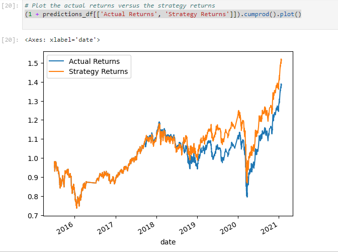
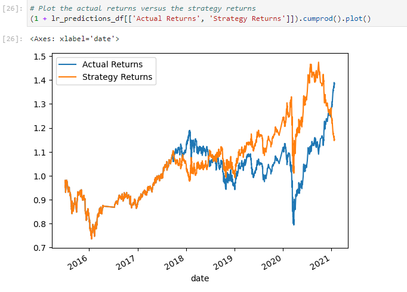

# Algorithmic-Trading-Homework
Algorithmic Trading Homework Assignment (Homework #14)

In this Challenge, I assume the role of a financial advisor at one of the top five financial advisory firms in the world. My firm constantly competes with the other major firms to manage and automatically trade assets in a highly dynamic environment. In recent years, my firm has heavily profited by using computer algorithms that can buy and sell faster than human traders.

## What I Created

In Jupyter notebook, I combined my new algorithmic trading skills with my existing skills in financial Python programming and machine learning to create an algorithmic trading bot that learns and adapts to new data and evolving markets.

To complete the task the following steps were perfomed:

  * Establish a Baseline Performance
  * Tune the Baseline Trading Algorithm
  * Evaluate a New Machine Learning Classifier

## Tune the Baseline Trading Algorithm

In this section, I tuned and adjust, the model’s input features to find the parameters that result in the best trading outcomes. I chose the best by comparing the cumulative products of the strategy returns.

### Step 1: Tune the training algorithm by adjusting the size of the training dataset.
To do so, I sliced the data into different periods. I reran the notebook with the updated parameters, and record the results in this README.md file.

Question: What impact resulted from increasing or decreasing the training window?

Answer: When I dropped the training window down to 1 month everything stayed relatively the same to the original data besides the precision for -1.0 which was lower by .06. When I raised the training window to 9 month the 9 month window had a significant raise in the recall number in the -1.0 slot with the original being .04 and the raised value being .30

### Step 2: Tune the trading algorithm by adjusting the SMA input features.
I adjusted one or both of the windows for the algorithm. I reran the notebook with the updated parameters, and record the results in this README.md file.

Question: What impact resulted from increasing or decreasing either or both of the SMA windows?

Answer: When initially increasing both windows, it tends to show a lot of negatives with lower values within all 3 categories compared to the original data with the negatives subsiding when it gets towards the last few dates. It also has the lowest close prices initally in the beginning. The strategy returns shows a lot of negative fluctuation unlike the original as well. When initially decreasing both windows, it tends to show a lot of positives with lower values within the SMA Fast and Slow categories, but in the Actual Returns the value is higher typically compared to the original data. Towards the last few dates, it tends to show in the SMA Fast and Slow categories the values being higher than the original data. The strategy returns shows a lot of positive fluctuation above the original data as well as a bit of negative fluctuation.

### Step 3: Choose the set of parameters that best improved the trading algorithm returns.
I saved a PNG image of the cumulative product of the actual returns vs. the strategy returns, and documented the conclusion in this README.md file.

### Predictions_df Actual and Strategy Returns

### LR_predictions_df Actual and Strategy Returns

